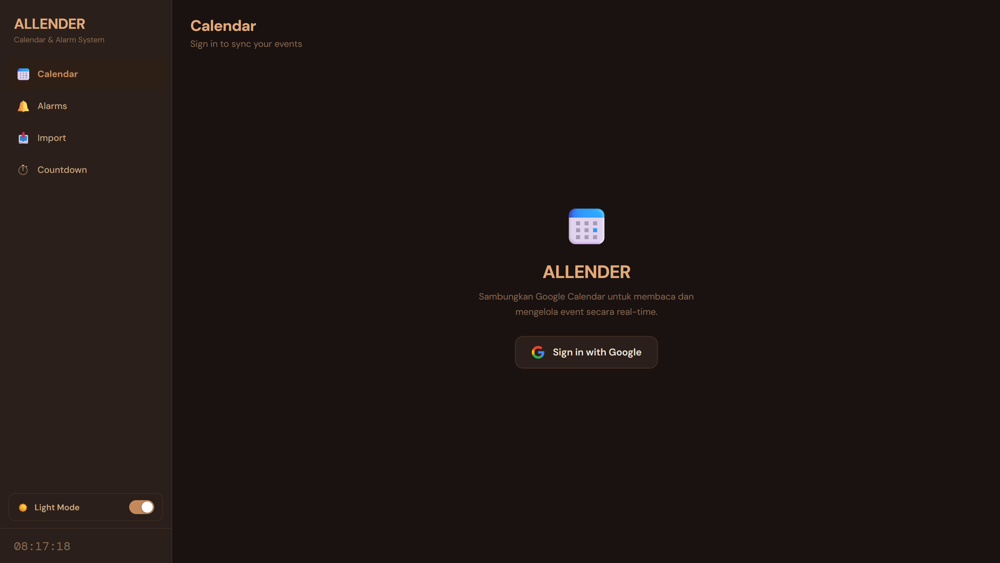
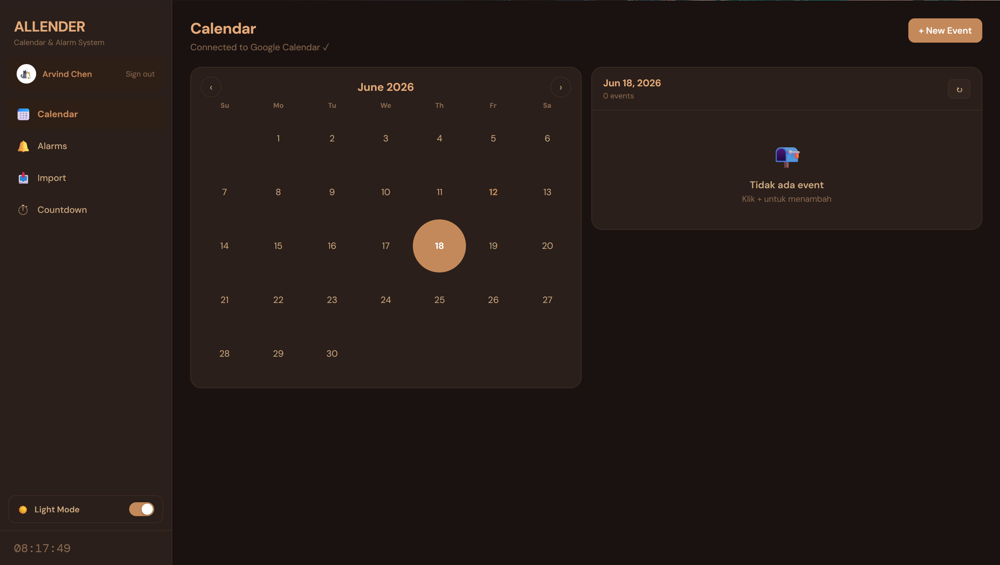

<div align="center">

# ALLENDER

### 📅 Smart Calendar • ⏰ Alarm • ⌛ Countdown Management System

Manage schedules, reminders, deadlines, and Google Calendar events from a single platform.

🌐 **Website:** https://allenderv-2.vercel.app/


</div>

---

## 📌 Overview

ALLENDER adalah aplikasi berbasis web yang mengintegrasikan **Kalender**, **Alarm**, dan **Countdown Timer** dalam satu platform. Aplikasi ini dirancang untuk membantu pengguna mengelola jadwal, alarm, serta tenggat waktu dengan lebih efisien melalui antarmuka yang sederhana, modern, dan responsif.

---

## 🚨 Latar Belakang

Dalam kehidupan sehari-hari, pengguna sering menggunakan beberapa aplikasi berbeda untuk mengelola aktivitas mereka.

| Aplikasi       | Fungsi                                            |
| -------------- | ------------------------------------------------- |
| 📅 Kalender    | Mencatat jadwal dan agenda                        |
| ⏰ Alarm        | Memberikan pengingat aktivitas penting            |
| ⌛ Countdown    | Menghitung waktu menuju suatu acara atau deadline |
| 📊 Import CSV | Mengelola data jadwal dalam jumlah besar          |

Penggunaan banyak aplikasi secara terpisah menyebabkan beberapa kendala:

* ❌ Informasi jadwal tersebar di berbagai platform.
* ❌ Pengguna harus memasukkan data yang sama berulang kali.
* ❌ Sulit memantau tenggat waktu dan pengingat dalam satu tampilan.
* ❌ Tidak tersedia fitur impor data jadwal dalam jumlah besar.

---

## 💡 Solusi

ALLENDER hadir sebagai solusi dengan menggabungkan fungsi kalender, alarm, countdown timer, dan impor data dalam satu aplikasi terintegrasi.

Melalui integrasi dengan Google Calendar, pengguna dapat mengelola seluruh aktivitas dan pengingat tanpa perlu berpindah-pindah aplikasi.

```text
            ┌─────────────┐
            │   Calendar  │
            └──────┬──────┘
                   │
                   ▼
        ┌─────────────────────┐
        │      ALLENDER       │
        └─────────────────────┘
          │       │        │
          ▼       ▼        ▼
       Alarm  Countdown  CSV Import
```

---

## 🎯 Manfaat

Dengan menggunakan ALLENDER, pengguna dapat:

* ✅ Mengelola jadwal dan pengingat dalam satu aplikasi.
* ✅ Mengurangi penggunaan banyak aplikasi secara bersamaan.
* ✅ Memantau deadline dan acara penting dengan lebih mudah.
* ✅ Mengimpor jadwal dalam jumlah besar secara cepat.
* ✅ Meningkatkan produktivitas dalam mengatur aktivitas sehari-hari.

---

# ✨ Fitur Utama

## 📅 Calendar

* Menampilkan jadwal dalam tampilan kalender bulanan.
* Menambahkan event baru.
* Menghapus event.
* Sinkronisasi langsung dengan akun Google Calendar.

---

## ⏰ Alarm

* Membuat alarm satu kali.
* Membuat alarm berulang (*Recurring Alarm*).
* Memberikan label pada alarm.
* Menentukan interval alarm.
* Menggunakan ringtone custom.
* Menampilkan notifikasi alarm secara visual.

---

## ⌛ Countdown

* Menghitung mundur menuju tanggal dan waktu tertentu.
* Memberikan nama pada countdown.
* Menampilkan sisa waktu secara real-time.
* Memutar notifikasi ketika countdown selesai.

---

## 📂 Import CSV

* Import jadwal dari file CSV.
* Drag & Drop file CSV.
* Paste data CSV langsung ke web.
* Menambahkan event ke Google Calendar secara jumlah besar.

---

## 🎨 Simple & Modern Design

* 🌙 Dark Mode
* ☀️ Light Mode
* 📱 Responsive untuk desktop dan mobile
* ✨ Tampilan sederhana dan mudah digunakan

---

# 🚀 Cara Pakai

## Login Google

Fitur **Calendar** dan **Import CSV** memerlukan akun Google.

Klik **Sign in with Google** pada halaman Calendar untuk mulai menggunakan fitur sinkronisasi Google Calendar.

> Alarm dan Countdown dapat digunakan tanpa login.

---

## ⏰ Membuat Alarm

1. Buka tab **Alarms**.
2. Klik **+ New Alarm**.
3. Pilih waktu dan label alarm.
4. Pilih tipe alarm:

   * **Hari Berulang** → alarm berbunyi setiap hari yang dipilih.
   * **Tanggal Spesifik** → alarm berbunyi sekali pada tanggal dan waktu tertentu.
5. Tambahkan interval untuk membuat beberapa alarm sekaligus (opsional).

Contoh:

```text
Base Alarm : 07:00
+15 Menit  : 07:15
+30 Menit  : 07:30
```

6. Pilih ringtone.
7. Klik **Set Alarm**.

---

## ⌛ Membuat Countdown

1. Buka tab **Countdown**.
2. Isi tanggal target.
3. Isi waktu target.
4. Masukkan nama event.
5. Pilih ringtone.
6. Klik **Mulai**.

---

## 📂 Import CSV

1. Buka tab **Import**.
2. Drop file CSV, klik browse, atau paste data CSV langsung.
3. Preview event yang terdeteksi.
4. Klik **Import ke Google Calendar**.

### Format CSV

```csv
title,start,end,note
Rapat Tim,2026-06-15T09:00,2026-06-15T10:00,Weekly
Ujian,2026-06-20T08:00,2026-06-20T12:00,
```

---

# ⚙️ Teknologi

## Frontend

* HTML
* CSS
* Vanilla JavaScript

## API & Services

* Google Calendar API → baca dan tulis event kalender.
* Google Identity Services → OAuth Login Google.

## Audio

* Web Audio API → ringtone bawaan (Beep, Chime, Buzz, Retro).
* HTML5 Audio → ringtone custom yang diunggah pengguna.

## Deployment

* Vercel → Hosting aplikasi web statis.

---

# 📁 Struktur Proyek

```text
ALLENDER/
│
├── Assets
├── index.html
└── vercel.json
```

### Keterangan

| File        | Fungsi                                                  |
| ----------- | ------------------------------------------------------- |
| index.html  | Berisi HTML, CSS, dan seluruh logika Vanilla JavaScript |
| vercel.json | Konfigurasi deployment Vercel                           |

---

# 📝 Notes

* Data alarm tidak tersimpan jika halaman di-refresh (hanya tersimpan di memori browser).
* Alarm hanya dapat berbunyi selama tab browser masih aktif.
* Format tanggal menggunakan standar ISO 8601.

Contoh:

```text
YYYY-MM-DDTHH:MM
```

```text
2026-06-15T09:00
```

---

# 🌐 Website

https://allenderv-2.vercel.app/

---

## 📸 Mock Up

### Landing Page & Google Calendar Authentication

Tampilan awal aplikasi ALLENDER sebelum pengguna terhubung dengan akun Google. Pada halaman ini pengguna dapat melakukan autentikasi menggunakan Google Account untuk mengakses dan mengelola event secara langsung melalui Google Calendar.

<p align="center">
  
</p>
---

### Calendar Dashboard

Halaman utama kalender yang menampilkan seluruh event dalam tampilan bulanan. Pengguna dapat membuat, melihat, dan menghapus event yang tersinkronisasi secara real-time dengan Google Calendar.

<p align="center">
  
</p>
---

### Calendar Event View

Tampilan kalender ketika event telah berhasil ditambahkan. Informasi event ditampilkan pada panel detail sehingga pengguna dapat memantau jadwal dengan lebih mudah.

<p align="center">
  
</p>
---

### Empty Calendar State

Tampilan ketika tidak terdapat event pada tanggal yang dipilih. Desain ini memberikan pengalaman pengguna yang tetap bersih dan informatif.

<p align="center">
  
</p>
---

### Alarm Management

Fitur alarm yang memungkinkan pengguna membuat alarm satu kali maupun alarm berulang. Pengguna juga dapat memilih ringtone bawaan atau mengunggah ringtone sendiri sesuai kebutuhan.


---

### CSV Import to Google Calendar

Fitur impor data jadwal dalam format CSV. Pengguna dapat melakukan drag & drop file CSV maupun menempelkan data secara langsung untuk ditambahkan ke Google Calendar secara massal.


---

### Countdown Timer

Fitur countdown timer untuk menghitung mundur menuju suatu acara atau tenggat waktu tertentu. Pengguna dapat menentukan nama event, tanggal target, waktu target, serta ringtone notifikasi yang akan diputar saat countdown selesai.


---

### Responsive Dark & Light Mode

ALLENDER mendukung tema Dark Mode dan Light Mode yang dapat diganti secara langsung sesuai preferensi pengguna untuk meningkatkan kenyamanan penggunaan.

| Dark Mode | Light Mode |
|-----------|------------|
|  |  |

## 👨‍💻 Developer

Developed with ❤️ using HTML, CSS, Vanilla JavaScript, Google Calendar API, and Vercel.
